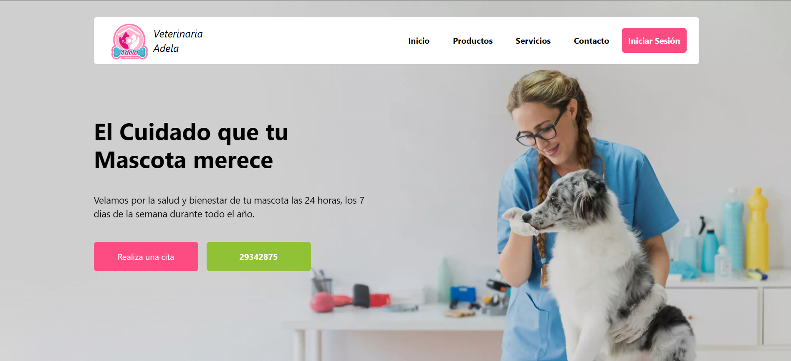
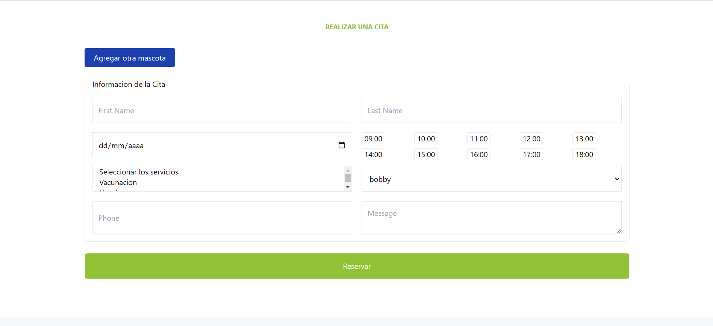
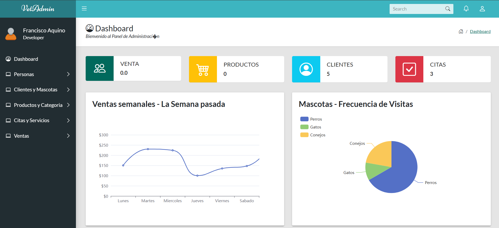

## Sistema Web para una Veterinaria

Proyecto universitario que consistió en una aplicación web para la administración de una veterinaria.
Contribuí al desarrollo construyendo el frontend utilizando HTML, CSS/SASS y JavaScript para la interactividad con el sitio. 
También implemente la autenticacón para los diferentes roles de los usuarios, e hice uso de la librería Commons Email para 
el envio de emails para los nuevos usuarios.

**Tecnologias:** Java, Jakarta EE, Lombok, HTML, CSS, JavaScript, Jquery, Commons Email

### Visuales
---

--

--
